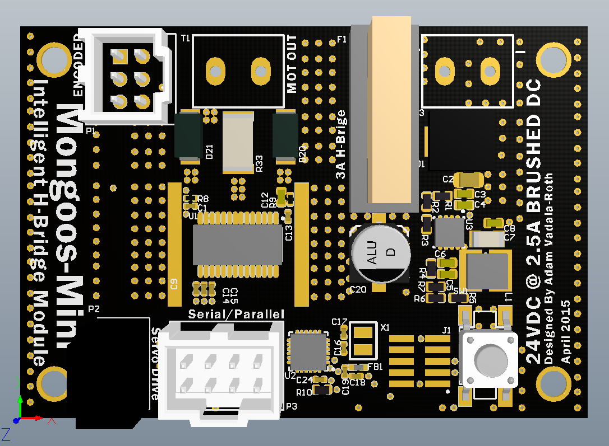

# MongooseMini
A DRV8829 based intelligent brushed DC Motor driver

MongooseMini
- 24 VDC @ 3A Motor Winding
- DRV8829 DC Motor H-Bridge
- FreeScale MKL05 VQFN24
- 100mA 3V3 Switching DCDC Converter (input same as motor rail voltage)
- Quadrature encoder interface
- I2C Interface for Control
- Standard Parallel H-Bridge Interface (Direction, brake, PWM)
- Servo Signal Interface (127 = stop, 255 = full tilt)

Rev 1 PCB

3D Render of PCB

